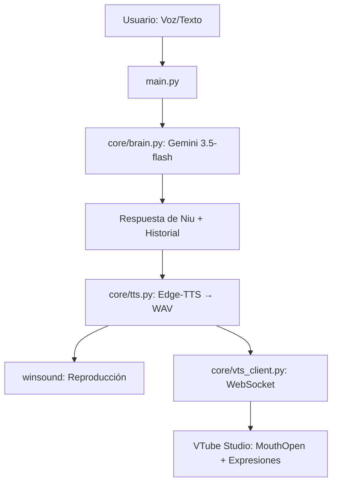

# 📄 CONTEXTO DEL PROYECTO: NIU AUTONOMOUS ENGINE

## 🎯 Visión General

**Proyecto:** Niu Autonomous Engine — Motor Cognitivo y Multimodal para VTuber IA  
**Objetivo:** Crear una VTuber autónoma ("Niu") con:
- Razonamiento y memoria persistente (Gemini)
- Voz expresiva estilo anime (Edge-TTS)
- Sincronización labial en tiempo real (VTube Studio + WebSocket)
- Expresiones emocionales dinámicas
- Entrada por voz (STT) y texto

**Stack:** Python 3.11+ | `google-genai` | `edge-tts` | `websockets` | `winsound` | `SpeechRecognition`

---

## 🏗️ Arquitectura Actual (Fase 2 Completada)

```
Vtuber IA odyssey/
├── core/
│   ├── __init__.py
│   ├── brain.py          # Cerebro: Gemini + Memoria + System Instruction
│   ├── tts.py            # Voz: Edge-TTS (DaliaNeural + pitch/rate) → WAV
│   └── vts_client.py     # VTube Studio: WebSocket + Auth + Parámetros + Expresiones
├── main.py               # Orquestador: Lip-sync (RMS) + Expresiones + CLI
├── requirements.txt
├── .env                  # GOOGLE_API_KEY (no versionado)
├── vts_token.txt         # Token VTS persistente (no versionado)
└── dia_por_dia/          # Historial de aprendizaje (Días 0-19)
```

### Flujo de Datos Principal



---

## 📜 Historial de Decisiones (ADR)

| Fecha | Decisión | Razón |
|-------|----------|-------|
| Día 0-5 | Python 3.11 en `.venv` | Compatibilidad `PyAudio`/`SpeechRecognition` |
| Día 6-7 | SDK `google-genai` (no legacy) | Tipado estricto, modelos actuales |
| Día 11-12 | Memoria manual `List[Content]` + Sliding Window | Control total, evita bugs de `ChatSession` |
| Día 13-14 | `io.BytesIO` para imágenes | Serialización binaria canónica |
| Día 16 | Separación Cerebro/Voz | Modelos TTS rechazan `system_instruction` |
| Día 17-18 | Edge-TTS (DaliaNeural) + pitch/rate | Voz anime expresiva, sin cuota Gemini TTS |
| Día 19 | WebSocket persistente + token local | Evita re-autenticación manual |
| Día 20 | Lip-sync RMS → `MouthOpen` | Tiempo real sin librerías pesadas |

---

## 🔑 Configuración Requerida

### `.env` (crear en raíz)
```bash
GOOGLE_API_KEY=tu_api_key_de_google_ai_studio
```

### VTube Studio
1. Abrir VTube Studio
2. Configuración → API → Activar servidor WebSocket (puerto 8001)
3. Primera ejecución: aceptar ventana de permisos "NiuAutonomousEngine"

---

## 🧪 Estado de la API (Importante)

**Problema actual:** Cuota gratuita Gemini agotada / Modelos flash saturados (503/429)
- `gemini-3.5-flash`: 503 UNAVAILABLE (alta demanda)
- `gemini-3.1-pro`: 429 QUOTA_EXCEEDED
- **Workaround:** Esperar reset de cuota (diario) o usar plan de pago

**Modelos probados y funcionales cuando hay cuota:**
- `gemini-3.5-flash` (rápido, cuota flash)
- `gemini-flash-latest` (alias estable)
- `gemini-3.1-flash` (si disponible en v1beta)

---

## 🚀 Cómo Ejecutar

```powershell
# Activar entorno
& ".\.venv\Scripts\python" "main.py"

# Opciones:
# 1 - Hablar por micrófono (STT Google)
# 2 - Escribir por texto
# 4 - Salir
```

---

## 📦 Dependencias (requirements.txt)

```
google-genai
python-dotenv
Pillow
SpeechRecognition
PyAudio
edge-tts
websockets
```

*Nota: `winsound` y `wave` son stdlib de Windows. `PyAudio` requiere Python 3.11.*

---

## 🎓 Próximos Pasos Sugeridos (para cuando retomes)

1. **Migración a `pydantic-settings`** para config tipada
2. **Logging estructurado** (`loguru` o `structlog`)
3. **Tests unitarios** para `brain.py` (memoria, poda) y `vts_client.py`
4. **Interrupciones de voz** (barge-in): cancelar TTS si usuario habla
5. **Modelo Live2D propio** (dibujar en capas → Live2D Cubism → VTube Studio)
6. **Streaming de audio** (evitar archivo temporal WAV)
7. **Métricas/Observabilidad** (latencia, tokens, errores)